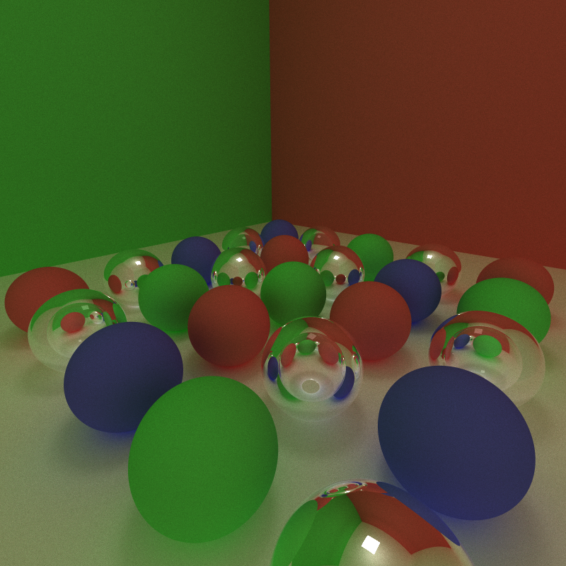
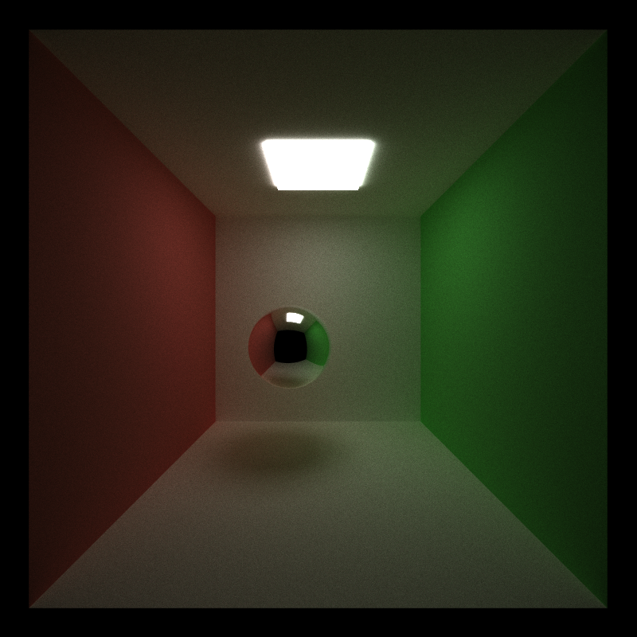
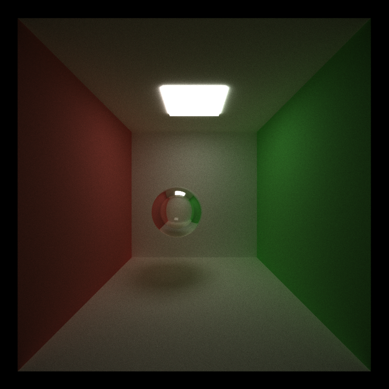
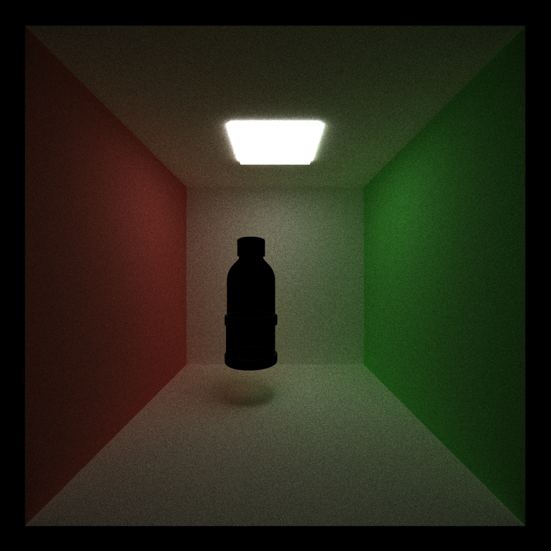
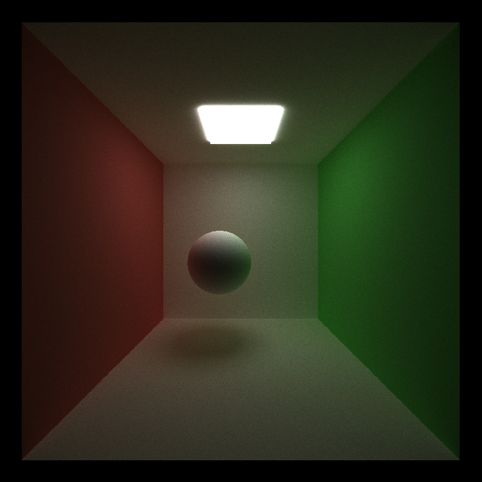
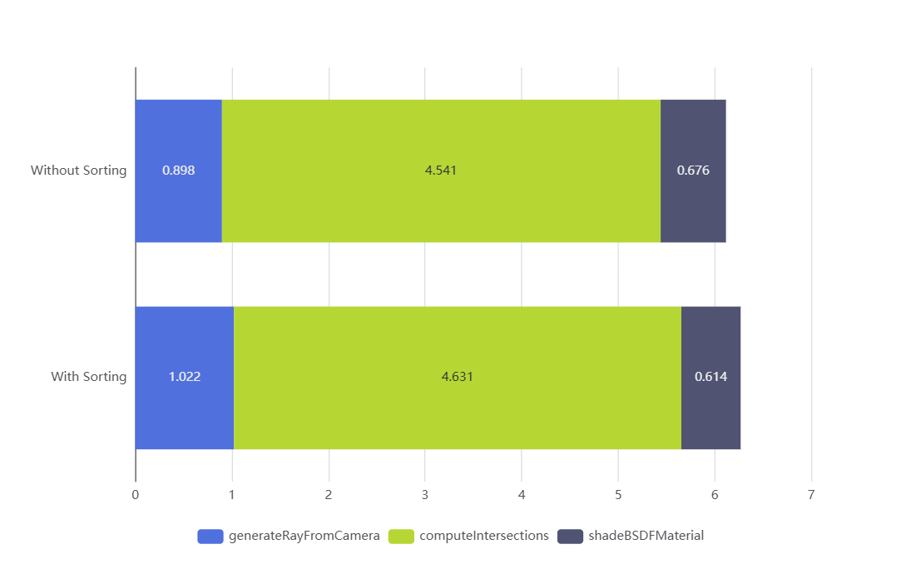
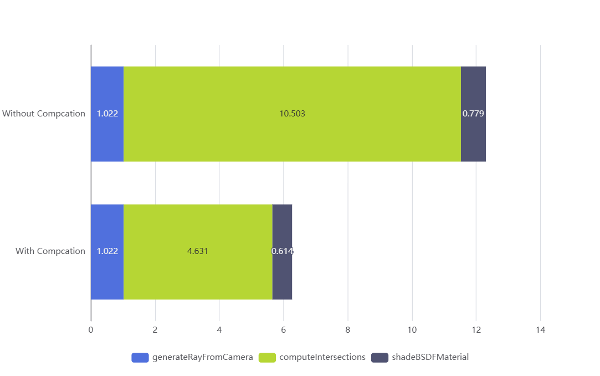
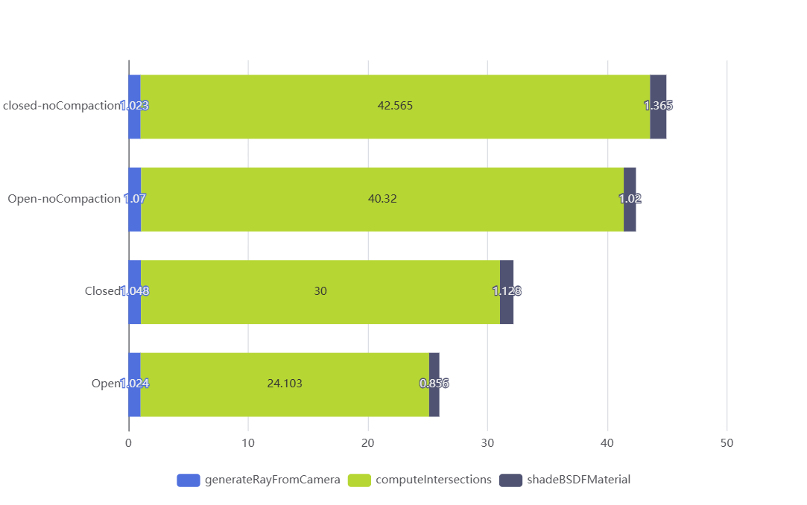

CUDA Path Tracer
================

**University of Pennsylvania, CIS 565: GPU Programming and Architecture, Project 3**

* Hongyi Ding
  * [LinkedIn](https://www.linkedin.com/in/hongyi-ding/), [personal website](https://johnnyding.com/)
* Tested on: Windows 11, i7-12700 @ 2.10GHz 32GB, NVIDIA T1000 4GB (SEAS Virtual Lab)

### Screenshots

A grid of 25 spheres that have diffuse, reflective and refractive surfaces.



### BSDF Shading


The path tracing algorithm is based on **Rendering Equation**
$$
L_o(p,\omega_o)=\int_{\Omega^+}L_i(p,\omega_i)f_r(p,\omega_i\to\omega_o)\cos\theta \mathrm{d}\omega_i
$$
The interpretation here is that if we want to calculate the lighting at position $p$ with BRDF model, the output lighting $L_o(p,\omega_o)$ in view direction $\omega_o$ is the integral of all input lighting $L_i(p,\omega_i)$ in direction $\omega_i$ multiplied by a coefficient when $\omega_i$ is taken on the hemisphere around the normal at $p$. The coefficient is the BRDF function $f_r(p,\omega_i\to\omega_o)$ and $\cos\theta$, where theta is the angle between $\omega_i$ and the normal.

Since we cannot directly calculate the integral, we use the **Monte Carlo Estimator** to get the approximate result. To calculate the integral $I=\int f(x)\mathrm{d}x$, and the sampling pdf is $X_i\sim p(x)$, then the estimator is $\frac{1}{N}\sum_{i=1}^N\frac{f(X_i)}{p(X_i)}$, where $N$ is the number of samples.

Every time the ray hits a BRDF material, we sample a direction and spawn a new light. To decide when to stop the recursive procedure, we limit the maximum reflection times, and adopt **Russian Roulette Test**. Each ray has $P\_RR$ probability to survive, and if it does survive, we multiply its contribution by $\frac{1}{P\_RR}$.

### Ideal Specular and Translucent Material





If any ray hits an object with ideal specular material, then we don't do direct sampling or Russian Roulette test. The reflected ray is calculated with $\omega_i=2(\omega_o\cdot n)n-\omega_o$, where $n$ is the normal at intersection.

The calculation of refracted ray is similar but a little more complicated. The refraction ratio is define by $ratio=\frac{\sin\theta}{\sin\theta^\prime}$, where $\theta,\theta^\prime$ are the angle between $\omega_o,\omega_i\in(0,\frac{\pi}{2})$ and the normal respectively. For the ray entering glass from air, the typical ratio is 1.5, and entering air from glass, it is $\frac{1}{1.5}$. If the refraction cannot happen ($\frac{\cos\theta}{ratio}>1$), the ray is reflected, which is **Total Internal Reflection**. Sometimes even if total internal reflection does not happen, the ray will be reflected. According to **Schlick’s approximation**, the probability of reflection is $R_0+(1-R_0)(1-\cos\theta)^5$, where $R_0=\left(\frac{n_1-n_2}{n_1+n_2}\right)^2$, $n_1,n_2$ are the indices of reflection of 2 media.

### Rendering custom glTF model



We used the library [tinygltf](https://github.com/syoyo/tinygltf/tree/release) for loading glTF models. The models are loaded as object space into a triangle `Mesh` structure, and rendered with naive triangle intersection tests. The material should be the same as other objects, however, the output image doesn't show the color is correctly rendered, which is still to be fixed.

To correctly have the meshes information on GPU, we have to define an equivalent structure called `MeshGPU`, which stores the array of `positions` and `normals`, also the BVH tree information from the next section. It's easy to use `vector` on CPU, however it does require a converting process to have the same data on GPU.

### BVH Structure on GPU

Till now, for each ray we do intersection test with every geometry in the scene, which is very costly. For rendering scenes with large mesh, we must adopt some accelerating structure. When importing an object mesh, we build a BVH recursively. For each tree node, we divide the triangles into two parts, and put them into the left child and the right child, until we arrive at a leaf node with only one or a few triangles. We can cut at half after sorting the triangles by the x/y/z coordinates of the center in turn.

To store all the data structure on GPU, we cannot use `vector` and we have to flat the BVH nodes into a single array. After finishing building the BVH tree, we flat the BVH nodes into an array and use indices to indicate the relationship between nodes.

#### Stochastic Sampling

This is the comparison of with/without stochastic sampling. As we can see in the output image, it reduce the aliasing effect. Instead of generate a fixed ray for each pixel, we add some random noise to the direction of ray, then objects won't have sharp edges.

**With** Stochastic Sampling:


**Without** Stochastic Sampling:



### Performance Analysis

#### The Impact of Sorting by Material

This is the average time cost for each kernel, when sorting by material is **enabled** (tested on `cornell.json`)

```
Kernel generateRayFromCamera mean: 1.022 ms
Kernel computeIntersections mean: 4.631 ms
Kernel shadeBSDFMaterial mean: 0.614 ms
```

This is the average time cost for each kernel, when sorting by material is **disabled** (tested on `cornell.json`)

```
Kernel generateRayFromCamera mean: 0.898 ms
Kernel computeIntersections mean: 4.541 ms
Kernel shadeBSDFMaterial mean: 0.676 ms
```

And this is the comparison graph



By sorting intersected rays by material, we can reduce the amount of branch diverge in a warp in `shadeBSDFMaterial`. If most rays in a warp hit the same material, then we don't need to do a lot of branching inside the BSDF kernel. However in this test, there was not much divergence in material, thus the impact of Sorting is not obvious. However, we do still observer a 10% reduction of running time of `shadeBSDFMaterial`.

#### With and Without Stream Compaction

This is the average time cost for each kernel, when stream compaction is **enabled** (tested on `cornell.json`)

```
Kernel generateRayFromCamera mean: 1.022 ms
Kernel computeIntersections mean: 4.631 ms
Kernel shadeBSDFMaterial mean: 0.614 ms
```

This is the average time cost for each kernel, when stream compaction is **disabled** (tested on `cornell.json`)

```
Kernel generateRayFromCamera mean: 1.022 ms
Kernel computeIntersections mean: 10.503 ms
Kernel shadeBSDFMaterial mean: 0.779 ms
```

And this is the comparison graph



From the results we can see, compaction is improving the effectiveness of `computeIntersections` greatly, by removing rays that has already terminated. Without compaction, we are still allocating GPU resources to rays that has already terminated (no intersection). And we can make the proposition that compaction works the best when the scene is open. In this specific case, the scene is open and the performance is increased by 26.8%.

#### Open Scene v.s. Closed Scene

We have created 2 test scenes `grid_spheres_open.json` and `grid_spheres.json`. They are basically the same, except for that in `grid_spheres.json` all the objects are inside a box while `grid_spheres_open.json` doesn't have a ceiling.

This is the average time cost for each kernel, for `grid_spheres_open.json`

```
Kernel generateRayFromCamera mean: 1.024 ms
Kernel computeIntersections mean: 24.103 ms
Kernel shadeBSDFMaterial mean: 0.856 ms
```

This is the average time cost for each kernel, for `grid_spheres.json`

```
Kernel generateRayFromCamera mean: 1.048 ms
Kernel computeIntersections mean: 30.000 ms
Kernel shadeBSDFMaterial mean: 1.128 ms
```

However, if compaction is disabled, the average time cost for each kernel, for `grid_spheres_open.json` becomes

```
Kernel generateRayFromCamera mean: 1.070 ms
Kernel computeIntersections mean: 40.320 ms
Kernel shadeBSDFMaterial mean: 1.020 ms
```

And the average time cost for each kernel, for `grid_spheres.json` becomes

```
Kernel generateRayFromCamera mean: 1.023 ms
Kernel computeIntersections mean: 42.565 ms
Kernel shadeBSDFMaterial mean: 1.365 ms
```

And this is the comparison graph



For the open scene, we can see a performance increase of 67.3%. However for the open scene, the performance increase is only 41.9%. This is because for open scenes, there are more ray terminations, then more resource can be saved with stream compaction. So we can come to the conclusion that stream compaction has a greater impact on open scenes.